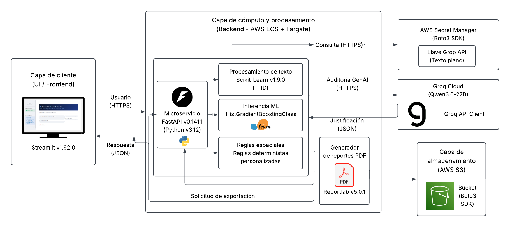

# Sistema de Clasificación e Inferencia de Siniestros Vehiculares — Subocol IA

En este repositorio se presenta una solución MLOps de producción para la evaluación automatizada de coherencia entre testimonios de siniestros, métricas de repuestos e inspección física. Utiliza un **sistema híbrido multinivel** que combina Machine Learning tabular/NLP (`HistGradientBoostingClassifier` + TF-IDF), reglas deterministas sintácticas/espaciales y **Auditoría de GenAI** (vía Groq SDK) para la generación de dictámenes y justificaciones técnicas en tiempo real.

Se realiza a su vez un despliegue por medio de un pipeline ci-cd por medio de GitHub actions que permite aplicar fases de pruebas unitarias del software, generación de las imagenes y contenedores de software tanto de la interfaz gráfica de usuario como del servicio de la API y por último de sube a los servidores AWS para ser consumido por ECS, S3 y Fargate.

---

## Estrategia de Modelado y Criterio de Negocio

Por mandato de negocio, la prioridad crítica del sistema es minimizar las "fugas" de capital asociadas al pago de siniestros indebidos o desproporcionados, garantizando al mismo tiempo explicabilidad técnica para los peritos periciales.

- **Métrica Objetivo:** Maximizar el **Recall** en la clase **OBJETADO** y el **$F_2$-Score** (penalizando los Falsos Negativos más severamente que los Falsos Positivos).
- **Calibración de Umbral (Threshold Tuning):**
  - Con el umbral estándar ($\tau = 0.50$), el modelo tradicionalmente captura solo el $75.4\%$ de los siniestros objetados.
  - Al aplicar calibración de umbral a **$\tau = 0.20$**, la sensibilidad sobre la clase objetada se eleva al **$91.40\%$**, logrando un $F_2$-Score de **0.8569**.

---

## Arquitectura del Sistema Híbrido

El pipeline de inferencia procesa cada solicitud a través de 3 capas independientes y complementarias:

1. **Capa 1: Reglas Sintácticas y Espaciales (Regex)**
   - Extrae patrones cruzados entre la narrativa de los hechos y la ubicación de las piezas (e.g., colisión frontal vs. piezas traseras reclamadas).
2. **Capa 2: Inferencia Estadística y ML (HistGradientBoosting + TF-IDF)**
   - Vectoriza el texto (hechos y repuestos) y evalúa métricas cuantitativas (ratio de sustitución de piezas, volumen total). Retorna la probabilidad ($P_{\text{objetado}}$) aplicando el umbral $\tau = 0.20$.
3. **Capa 3: Auditoría Pericial con IA Generativa (Groq API)**
   - Utiliza modelos de lenguaje de baja latencia a través de la SDK de Groq para auditar la coherencia física/cinética entre el relato y los daños exigidos, entregando una **Justificación Técnica** en formato es JSON estructurado.

---

## Diagrama de Flujo del Sistema

## 

## Estructura del Proyecto

```text
subocol-prueba/
├── .github/
│   └── workflows/
│       └── ci_cd.yml           # Pipeline de CI/CD (Lint, Tests, Docker, Terraform)
├── frontend/
│   ├── app.py                  # Dashboard interactivo en Streamlit
│   └── Dockerfile              # Dockerfile del contenedor frontend
├── models/
│   └── modelo_subocol_calibrado.joblib # Modelos y artefactos entrenados
├── src/
│   ├── api.py                  # FastAPI backend y endpoints principales
│   ├── processing.py           # Lógica de preprocesamiento, ML y cliente Groq LLM
│   ├── __init__.py
│   └── Dockerfile              # Dockerfile del contenedor backend
├── terraform/
│   ├── ecs.tf                  # Definición de tareas y servicios ECS Fargate
│   ├── main.tf                 # Configuración de red, S3, IAM, Secrets Manager y Clúster
│   └── providers.tf            # Configuración del proveedor de AWS
├── tests/                      # Suite de pruebas unitarias y de integración
├── .uv.lock                    # Lock nativo del entorno UV
├── .gitignore
├── docker-compose.yml          # Orquestación local multi-contenedor
├── Makefile                    # Automatización de tareas locales
└── pyproject.toml              # Gestión de dependencias con uv

```

## Replicación de Entorno con `uv`

Este proyecto utiliza **`uv`** como gestor de entornos y paquetes de alto rendimiento.

### 1. Requisitos Previos

- Python 3.10+
- `uv` instalado (`pip install uv` o vía ejecutable de Astral)
- Clave de API de Groq (`GROQ_API_KEY`)

### 2. Configuración de Variables de Entorno

Crea un archivo `.env` en la raíz del proyecto con el siguiente contenido:

```env
GROQ_API_KEY=gsk_tu_clave_de_groq_aqui
```

### 3. Instalación y Ejecución Local

```bash
# Clonar repositorio
git clone https://github.com/seba39399/agentic-subocol.git
cd agentic-subocol

# Sincronizar entorno virtual y dependencias con uv
uv sync

# 1. Levantar la API REST con FastAPI (Backend)
uv run uvicorn src.api:app --reload --port 8000

# 2. Levantar la Interfaz Gráfica con Streamlit (Frontend - Terminal secundaria)
uv run streamlit run src/app_ui.py
```

## Despliegue con Docker

El proyecto incluye un Dockerfile optimizado utilizando las capas de caché de uv:

```Bash
# Construir imagen Docker
docker build -t subocol-siniestros-api .

# Ejecutar contenedor pasando la variable de entorno
docker run -d -p 8000:8000 --env-file .env --name subocol-api subocol-siniestros-api
```

La API estará disponible en http://localhost:8000 y la documentación interactiva Swagger UI en http://localhost:8000/docs.

## API Endpoints

GET /health
Verificación de estado operativo (Liveness / Readiness probe) y respuesta estructurada Pydantic (HealthResponse).

Respuesta de Ejemplo:

```Bash
{
  "status": "ok",
  "service": "subocol-claims-auditor",
  "version": "1.0.0"
}
```

POST /predict

Evalúa la coherencia del reclamo a través del pipeline híbrido (ML + Reglas + Groq LLM).

Ejemplo de Petición (Payload):

```Bash
{
  "version_hechos": "Colisión por alcance en semáforo; vehículo detenido es impactado por detrás por otro automóvil.",
  "piezas_afectadas": "parachoques trasero, stop izquierdo, compuerta de baúl",
  "piezas_totales": 5,
  "piezas_cambio": 2
}
```

---

## Matriz de Validación y Casos de Prueba

El sistema ha sido evaluado mediante una suite de pruebas integrales para medir la respuesta del pipeline multinivel:

| Escenario de Prueba                                               | Inconsistencia Espacial | Probabilidad ML |   Dictamen    | Comportamiento del Auditor (GenAI)                   |
| :---------------------------------------------------------------- | :---------------------: | :-------------: | :-----------: | :--------------------------------------------------- |
| **Coherencia Total** (e.g., Alcance / Volcamiento)                |        `NO (0)`         |      < 10%      | **ENTREGADO** | Valida la física del impacto sin alertas.            |
| **Incompatibilidad Directa** (Frente vs. Trasero)                 |        `SÍ (1)`         |      25.5%      | **OBJETADO**  | Capturado por reglas Regex e identificado por LLM.   |
| **Incompatibilidad Estructural Compleja** (Frente vs. Suspensión) |        `SÍ (1)`         |      33.4%      | **OBJETADO**  | Detecta falta de transferencia de energía cinética.  |
| **Inflado Masivo de Repuestos** (Roce leve vs. 100% Cambio)       |        `NO (0)`         |      59.1%      | **OBJETADO**  | Objeción por desproporción entre severidad y piezas. |

---

## Resiliencia y Fallbacks (Graceful Degradation)

El pipeline implementa mecanismos de tolerancia a fallos en la capa de IA Generativa:

- **Groq API Fallback:** Si el servicio de Groq no responde, excede el rate limit o la clave `GROQ_API_KEY` es inválida, el sistema conmuta automáticamente al dictamen determinista (Reglas + ML) para no bloquear la inferencia en tiempo real.
- **Estructuración JSON Estricta:** Las llamadas al LLM imponen `response_format={"type": "json_object"}` para garantizar el parseo seguro en el backend.

---

## Arquitectura Cloud & MLOps (AWS + Terraform)

El despliegue está automatizado bajo una filosofía _Cloud-Native_ e infraestructura como código (IaC):

- **Orquestación:** Desplegado en **AWS ECS Fargate** (Serverless containers) dividiendo los contenedores de Frontend y Backend.
- **Gestión de Secretos:** Inyección segura de la API Key de Groq mediante **AWS Secrets Manager**.
- **Persistencia de Reportes:** Almacenamiento automatizado de dictámenes en formato PDF en buckets privados de **Amazon S3**.
- **Monitoreo:** Centralización de trazas y logs de rendimiento operativo a través de **AWS CloudWatch**.
- **Automatización (IaC):** Gestión completa de la red (VPC, Subnets, Internet Gateways), Security Groups y recursos IAM mediante **Terraform**.

---

## Escalabilidad a Big Data (PySpark Integration)

Aunque la API sirve inferencia de baja latencia vía FastAPI/Pandas (< 15 ms), la lógica central en `src/processing.py` fue diseñada de forma modular:

- Las funciones de limpieza de cadenas, extracción de n-gramas y chequeo de reglas espaciales pueden ser mapeadas como **PySpark `pandas_udf`**.
- Esto permite desplegar inferencia masiva (Batch) sobre clusters en AWS EMR o Databricks procesando millones de siniestros diarios almacenados en Data Lakes (Parquet/Delta Lake).

---

```markdown
---

## Autor

**Juan Sebastián Peña Valderrama**

- **Perfil:** Biomedical Engineer | Data Scientist | MLOps & Cloud Infrastructure Engineer.
```
